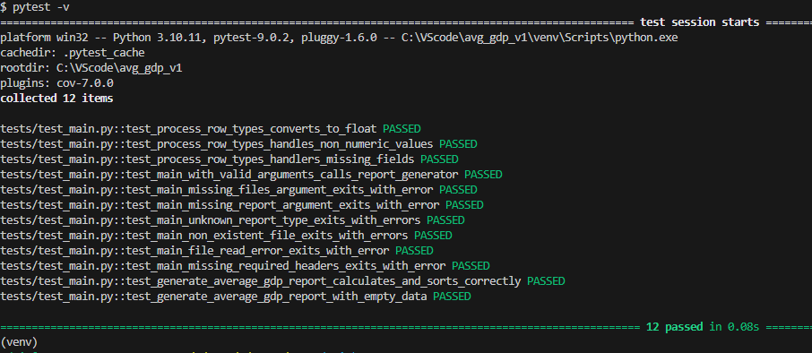
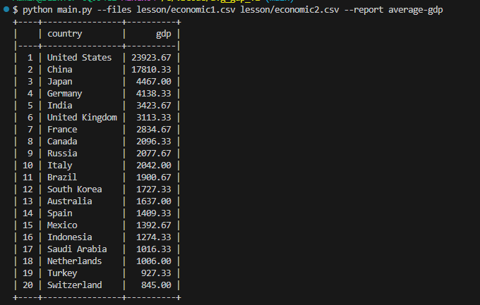
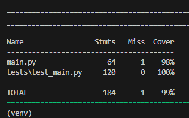

📊 Анализатор макроэкономических данных
Проект для анализа CSV-файлов с макроэкономическими показателями стран и формирования отчетов.

## Установка
```bash
# Клонируйте репозиторий
git clone https://github.com/BobrZla/avg_gdp.git
cd avg_gdp

# Создайте виртуальное окружение (опционально)
python -m venv venv
source venv/bin/activate  # для Linux/Mac
# или
venv\Scripts\activate     # для Windows

# Установите зависимости
pip install -r requirements.txt
```
## Запуск
Для удобства создайте в корне папку <span style="color: green"> "data" </span> и поместите туда ваши .csv файлы, например названиея будут <span style="color: green"> economic1.csv </span> и <span style="color: green"> economic2.csv </span> .
```bash
# Базовый запуск
python main.py --files data/economic1.csv --report average-gdp

# С несколькими файлами
python main.py --files data/economic1.csv data/economic2.csv --report average-gdp
```
## Пример вывода.
```bash
+----+----------------+----------+
|    | country        |      gdp |
|----+----------------+----------|
|  1 | United States  | 23923.67 |
|  2 | China          | 17810.33 |
|  3 | Japan          |  4467.00 |
|  4 | Germany        |  4138.33 |
|  5 | India          |  3423.67 |
|  6 | United Kingdom |  3113.33 |
|  7 | France         |  2834.67 |
|  8 | Canada         |  2096.33 |
|  9 | Russia         |  2077.67 |
| 10 | Italy          |  2042.00 |
| 11 | Brazil         |  1900.67 |
| 12 | South Korea    |  1727.33 |
| 13 | Australia      |  1637.00 |
| 14 | Spain          |  1409.33 |
| 15 | Mexico         |  1392.67 |
| 16 | Indonesia      |  1274.33 |
| 17 | Saudi Arabia   |  1016.33 |
| 18 | Netherlands    |  1006.00 |
| 19 | Turkey         |   927.33 |
| 20 | Switzerland    |   845.00 |
+----+----------------+----------+
```
## Требования
- Python 3.10

- Зависимости указаны в requirements.txt
------------------

# Для ревьюера.
Pytest

----
Работа скрипта

----
Покрытие тестами

----

## А теперь своими словами.
- Скрипт читает и правильно обрабатывает csv файлы.
- Выводит отчет "Среднее ВВП" в порядке убывания.
- Параметры --files и --report являются обязательными.
- Может считывать сразу несколько csv файлов.
- Выводит красиво используя tabulate, (не сразу заметил индексацию на примере из ТЗ, но потом поправил).
- Использовал только разрешенные библиотеки.
- Есть возможность добавления новых отчетов т.к. csv считывает основная функция и сам расчет вспомогательная, чтобы расшириться для добавления новых отчетов просто создаем новую вспомогательную функцию с нужной логикой расчетов и вывода и передает её в main.
Можно посмотреть на 138 сточке в main.py 

```python
    if args.report == "average-gdp":
        _generate_average_gdp_report(all_data)
```
Тут просто добавим новый elif с пробросом в нужную новую функцию.
- Покрыл код тестами, скрин выше с результатами, покрытие ~98%

Так-же дополнительно сделал проверки чтобы шапка csv была в нужном нам формате, с нужными полями, знаю что в ТЗ написано что входные данные всегда валидны, но на практике такого не бывает наверное никогда,  так-же сделал (в тз не было) правило что если в самом csv данные будут в неправильном формате, например когда gdp будет не Float а например строка или None, чтобы скрипт не падал, а менял значение на 0.0, но при этом сообщал пользователю что в файле есть ошибка, чтобы он её поправил.

Из того что можно было-бы улучшить, это более тщательную проверку входных данных, и не выполнять скрипт вообще если в них есть ошибка, и выкидывать собщение пользователю чтобы он эти ошибки в начале поправил.
Есть моменты дублирования кода,  это можно сократить, например в тех-же тестах можно использовать сами тесты с параметрами чтобы чуть сократить количество кода, но на момент написания я подумал что для вас так будет менее читабельно в моменте.

Заранее спасибо за обратную связь.